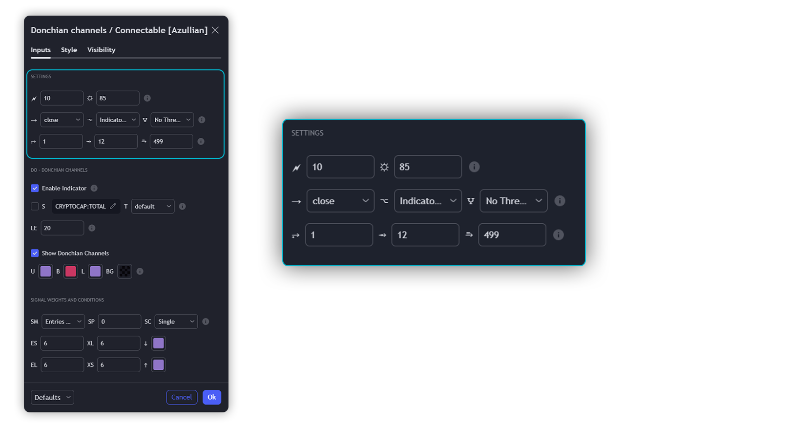

# Donchian Channels Indicator Guide

Refine your breakout trading techniques with Donchian Channels. Accurately pinpoint significant highs and lows, enhancing your capacity to detect and react to key market movements.

This connectable Donchian channels indicator is part of an indicator system designed to help test, visualize and build strategy configurations without coding. Like all connectable indicators, it interacts through the TradingView input source, which serves as a signal connector to link indicators to each other. All connectable indicators send signal weight to the next node in the system until it reaches either a connectable signal monitor, signal filter and/or strategy.

## Uniform Settings and A Way of Work

Although connectable indicators may have specific weight scoring conditions, they all aim to follow a standardized general approach to weight scoring settings, as outlined below.

### Connectable Indicators - Settings

- **Energy**: Energy applies an ATR multiplier to the plotted shapes on the chart. A higher value plots shapes farther away from the candle, enhancing visibility.
- **Brightness**: Brightness determines the opacity of the shape plotted on the chart, aiding visibility. Indicator weight also influences opacity.
- **Input**: Use the input setting to specify a data source for the indicator. Here you can connect the indicator to other indicators.
- **Flow**: Determine where you want to receive signals from:
  - Both: Weights from this indicator and the connected indicator will apply
  - Indicator only: Only weights from this indicator will apply
  - Input only: Only weights from the connected indicator will apply
- **Weight Multiplier**: Multiply all weights in the entire indicator by a given factor, useful for quickly testing different indicators in a granular setup.
- **Threshold**: Set a threshold to indicate the minimum amount of weight it should receive to pass it through to the next indicator.
- **Limiter**: Set a hard limit to the maximum amount of weight that can be fed through the indicator.

### Connectable Indicators - Weight Scoring Settings

- **SM – Signal Mode**: Enable specific conditions for weight scoring
  - All: All signals will be scored.
  - Entries only: Only entries will score 
  - Exits only: Only exits will score.
  - Entries & exits: Both entries and exits will score. 
  - Zone: Continuous scoring for each candle within the zone.
- **SP – Signal Period**: Defines a range of candles within which a signal can score.
- **SC - Signal Count**: Specifies the number of bars to retrospectively examine and score.
  - Single: Score for a single occurrence
  - All occurrences: Score for all occurrences
  - Single + Threshold: Score for single occurrences within the signal period (SP)
  - Every + Threshold: Score for all occurrences within the signal period (SP)

### Connectable Indicators - Weight Scoring Direction

- **ES**: Enter Short weight
- **XL**: Exit Long weight
- **EL**: Enter Long weight
- **XS**: Exit Short weight

### Connectable Indicators - Weight Scoring Values

- Weights can hold either positive or negative scores. Positive weights enhance a particular trading direction, while negative weights diminish it.

## DO - Indicator Settings

### Main Settings

- **Enable/Disable Indicator**: Toggle the entire indicator on or off.
- **S - Source**: Choose an alternative data source for the Donchian channels calculation.
- **T - Timeframe**: Select an alternative timeframe for the Donchian channels calculation.
- **LE - Length**: Determine the period the Donchian channels are calculated on.
- **Enable/Disable Plotting**: Toggle the plotting of the Donchian channels.
- **U**: Choose a color for the upper band.
- **B**: Choose a color for the basis.
- **L**: Choose a color for the lower band.
- **BG**: Choose a color for Donchian channels background.

### Scoring Functionality

- The Donchian channels score long entries when the current low price is equal to lower band.
- The Donchian channels score long exits when the current high price is equal to the upper band.
-  The Donchian channels score long zones the entire time the current low price is equal to the lower band.
-  The Donchian channels score short entries when the current high is equal to the upper band.
- The Donchian channels score short exits when the current low is equal to the lower band.
- The Donchian channels score short zones the entire time the current high price is equal to the upper band.

### Connectable Indicators - Plotting

- **Standard**: Symbols (EL, XS, ES, XL) appear relative to candles based on set conditions. Their opacity and position vary with weight.
- **Conditional Settings**: A larger icon appears if global conditions are met. For instance, with a Threshold(⥇) of 12, Signal Period (SP) of 3, and Scoring Condition (SC) set to "EVERY", a DO signaling over two times in 3 candles (scoring 6 each) triggers a larger icon.

## Usage of Connectable Indicators

### Connectable Chaining Mechanism

Connectable indicators can be linked in various ways:
- **Direct Chaining**: Connect an indicator directly to the signal monitor, signal filter, or strategy.
- **Daisy Chaining**: Indicators can be sequentially connected. The first in the chain should have a flow (⌥) set to 'Indicator only', with subsequent indicators set to 'Both'. The final indicator connects to the signal monitor, signal filter, and/or strategy.

### Setting Up This Indicator with a Signal Filter and Strategy

1. **Load all relevant indicators**
   - Load Donchian channels / Connectable
   - Load Signal filter / Connectable
   - Load Strategy / Connectable

2. **Signal Filter: Connect the Donchian channels to the Signal Filter**
   - Open the signal filter settings
   - Choose one of the three input dropdowns (1→, 2→, 3→) and choose: Donchian channels / Connectable: Signal Connector
   - Toggle the enable box before the connected input to enable the incoming signal

3. **Signal Filter: Update the filter signals settings if needed**
   - The default settings of the filter enable EL (Enter Long), XL (Exit Long), ES (Enter Short), and XS (Exit Short).

4. **Signal Filter: Update the weight threshold settings if needed**
   - All connectable indicators load by default with a score of 6 for each direction (EL, XL, ES, XS)
   - By default, weight threshold (TH) is set at 5. This allows each occurrence to score, as the default score in each connectable indicator is 1 point above the threshold. Adjust to your liking.

5. **Strategy: Connect the strategy to the signal filter in the strategy settings**
   - Select a strategy input → and select the Signal filter: Signal connector

6. **Strategy: Enable filter compatible directions**

> Now that everything is connected, you'll notice green spikes in the signal filter representing long signals, and red spikes indicating short signals. Trades will also appear on the chart, complemented by a performance overview. Your journey is just beginning: delve into different scoring mechanisms, merge diverse connectable indicators, and craft unique chains. Instantly test your results and discover the potential of your configurations. Dive deep and enjoy the process!

## Benefits

- **Adaptable Modular Design**: Arrange indicators using direct or daisy chaining for customized analysis approaches.
- **Streamlined Backtesting**: Facilitate smoother exploration of potential setups by simplifying the iterative process of testing and adjusting combinations.
- **Intuitive Interface**: Easily integrate indicators on TradingView, adjust settings, and set alerts without needing complex code.
- **Signal Weight Precision**: Allocate granular weights among signals for deeper customization in strategy formulation.
- **Signal Filtering**: Clearly define entry and exit conditions for enhanced strategy precision.
- **Clear Visual Feedback**: Utilize distinct visual signals and cues for improved chart readability and informed decision-making.
- **Standardized Defaults**: Benefit from universally recognized preset settings for consistent initial setups in indicators like momentum or volatility.
- **Reliability**: Trust in meticulously developed indicators that prevent repainting and adhere to TradingView's coding conventions.

## Compatible Indicators

- Indicators integrating the 'azLibConnector' library and following our conventions can be seamlessly integrated as detailed above.
- Look for the suffix ' / Connectable' for easy recognition of compatible indicators on TradingView.

## Common Mistakes, Clarifications, and Tips

- **Removing an Indicator from a Chain**: To avoid removing all underlying indicators in the object tree, disconnect adjacent indicators before deleting a linked one.
- **Point Systems**: Remember the 500 points cap for each direction (EL, XL, ES, XS) when setting up a point structure using the azLibConnector.
- **Flow Misconfiguration**: In daisy chains, set the first indicator to 'indicator only' and subsequent indicators to 'both' in the flow setting.
- **Hide Attributes**: Reduce visual clutter by disabling arguments in Chart Settings / Status line.
- **Layout and Abbreviations**: Familiarize yourself with our consistent structure and abbreviations, explained in inline tooltips.
- **Inputs**: Directly connecting a connectable indicator to the strategy delivers raw signals without a weight threshold, triggering a trade for every signal.

## Note of gratitude

  Through years of exploring TradingView and Pine Script, we've drawn immense inspiration from the community's knowledge and innovation. Thank you for being a constant source of motivation and insight.

## Risk disclaimer

  Azullian's content, tools, scripts, articles, and educational offerings are presented purely for educational and informational uses. Please be aware that past performance should not be considered a predictor of future results.

