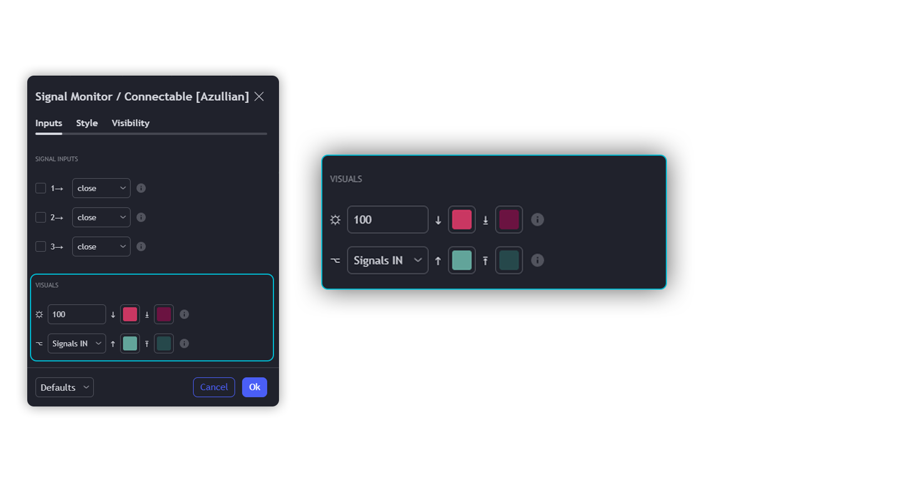
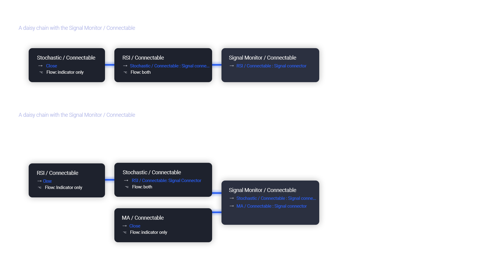

# MONITOR Indicator Guide

The connectable signal monitor is a connectable tool to help test, visualize signal weights. Like all connectable indicators, it interacts through the TradingView input source, which serves as a signal connector to link indicators to each other. All connectable indicators send signal weight to the next node in the system until it reaches either a connectable signal monitor, signal filter and/or strategy.

Let's review the separate parts of this indicator.

## INPUTS

We've provided 3 inputs for connecting indicators or chains (1→, 2→, 3→) which are all set to 'Close' by default.

An input has several controls:

- **Enable/Disable**: Toggle the entire input on or off.
- **Input**: Connect indicators here, choose indicators with a compatible: Signal connector.

## VISUALS

- **☼ Brightness %**: Set the opacity for the signal curves.
- **🡓 ES Color**: Set the color for the ES: Entry Short signal.
- **⭳ XS Color**: Set the color for the XS: Exit Short signal.
- **⌥ Plot mode**: Set the plotting mode
  - Signals IN: Show all signals
  - Signals OUT: Show only scoring signals
- **🡑 EL Color**: Set the color for the EL: Enter Long signal.
- **⭱ XL Color**: Set the color for the XL: Exit Long signal.

## Usage of Connectable Indicators

### Connectable Chaining Mechanism

Connectable indicators can be linked in various ways:
- **Direct Chaining**: Connect an indicator directly to the signal monitor, signal filter, or strategy.
- **Daisy Chaining**: Indicators can be sequentially connected. The first in the chain should have a flow (⌥) set to 'Indicator only', with subsequent indicators set to 'Both'. The final indicator connects to the signal monitor, signal filter, and/or strategy.

### Usage of Connectable Indicators

#### Connectable Chaining Mechanism

Connectable indicators can be connected directly to the signal monitor, signal filter, or strategy, or they can be daisy-chained to each other while the last indicator in the chain connects to the connectable signal monitor, signal filter, or strategy. When using a signal filter or signal monitor, you can chain the filter to the strategy input to make your chain complete.

- **Direct Chaining**: Connect an indicator directly to the signal monitor, signal filter, or strategy through the provided inputs (→).
- **Daisy Chaining**: Connect indicators using the indicator input (→). The first in a daisy chain should have a flow (⌥) set to 'Indicator only'. Subsequent indicators use 'Both' to pass the previous weight. The final indicator connects to the signal monitor, signal filter, or strategy.

#### Set Up the Signal Monitor with a Connectable Indicator and Strategy

Let's connect the MACD to a connectable signal monitor:

1. **Load all relevant indicators**: 
   - MACD / Connectable
   - Signal monitor / Connectable

2. **Signal Monitor: Connect the MACD to the Signal Monitor**: 
   - Open the signal monitor settings.
   - Choose one of the three input dropdowns (1→, 2→, 3→) and choose: MACD / Connectable: Signal Connector.
   - Toggle the enable box before the connected input to enable the incoming signal.

> Now that everything is connected, you'll notice green spikes in the signal monitor representing long signals, and red spikes indicating short signals.

## Benefits

- **Adaptable Modular Design**: Arrange indicators using direct or daisy chaining for customized analysis approaches.
- **Streamlined Backtesting**: Facilitate smoother exploration of potential setups by simplifying the iterative process of testing and adjusting combinations.
- **Intuitive Interface**: Easily integrate indicators on TradingView, adjust settings, and set alerts without needing complex code.
- **Signal Weight Precision**: Allocate granular weights among signals for deeper customization in strategy formulation.
- **Signal Filtering**: Clearly define entry and exit conditions for enhanced strategy precision.
- **Clear Visual Feedback**: Utilize distinct visual signals and cues for improved chart readability and informed decision-making.
- **Standardized Defaults**: Benefit from universally recognized preset settings for consistent initial setups in indicators like momentum or volatility.
- **Reliability**: Trust in meticulously developed indicators that prevent repainting and adhere to TradingView's coding conventions.

## Compatible Indicators

- Indicators integrating the 'azLibConnector' library and following our conventions can be seamlessly integrated as detailed above.
- Look for the suffix ' / Connectable' for easy recognition of compatible indicators on TradingView.

## Common Mistakes, Clarifications, and Tips

- **Removing an Indicator from a Chain**: To avoid removing all underlying indicators in the object tree, disconnect adjacent indicators before deleting a linked one.
- **Point Systems**: Remember the 500 points cap for each direction (EL, XL, ES, XS) when setting up a point structure using the azLibConnector.
- **Flow Misconfiguration**: In daisy chains, set the first indicator to 'indicator only' and subsequent indicators to 'both' in the flow setting.
- **Hide Attributes**: Reduce visual clutter by disabling arguments in Chart Settings / Status line.
- **Layout and Abbreviations**: Familiarize yourself with our consistent structure and abbreviations, explained in inline tooltips.
- **Inputs**: Directly connecting a connectable indicator to the strategy delivers raw signals without a weight threshold, triggering a trade for every signal.

## Note of gratitude

  Through years of exploring TradingView and Pine Script, we've drawn immense inspiration from the community's knowledge and innovation. Thank you for being a constant source of motivation and insight.

## Risk disclaimer

  Azullian's content, tools, scripts, articles, and educational offerings are presented purely for educational and informational uses. Please be aware that past performance should not be considered a predictor of future results.

