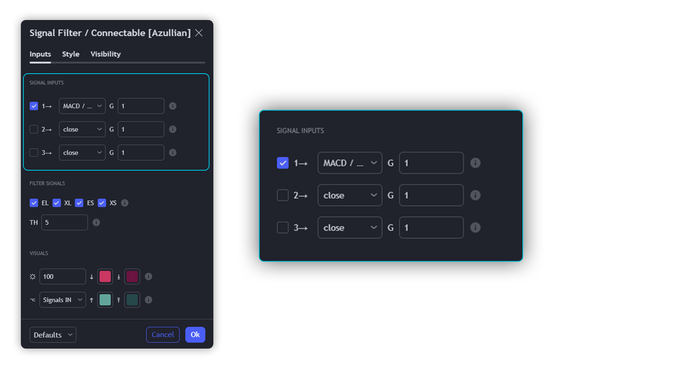
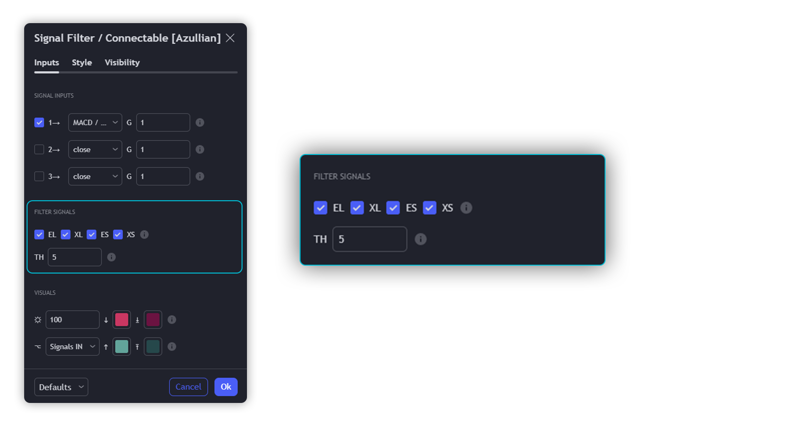
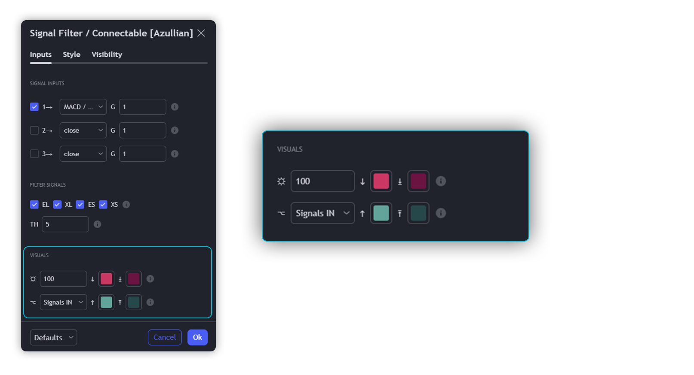
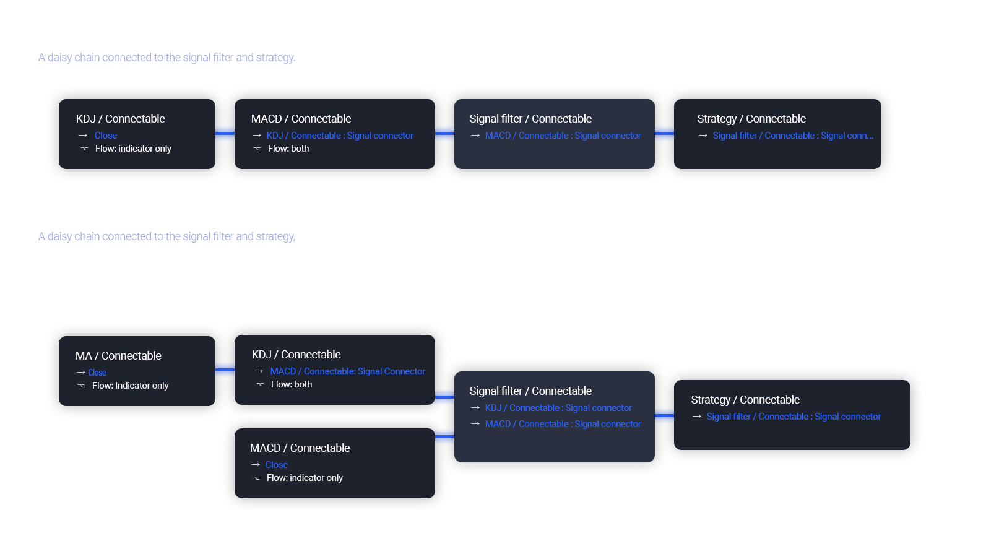

# Signal Filter Indicator Guide

Enhance your trading approach with the Connectable Signal Filter. This integral component is part of an innovative indicator system designed to streamline your trading experience by simplifying testing, visualization, and strategy building – all without the need for complex coding. Just like all other Connectable Indicators, the Signal Filter seamlessly interfaces with TradingView through a signal connector, allowing you to link indicators effortlessly within your trading system.

## The Multifaceted Role of the Connectable Signal Filter

The Connectable Signal Filter serves several vital functions within the Connectable Indicator system:

- **Input Hub:** Easily manage and connect indicators or daisy-chained indicators directly to the filter from one central location.
- **Modification:** Tailor incoming signals by applying smoothing, scaling, or other modifiers to suit your specific trading requirements.
- **Filtering:** Define trade directions and conditions that incoming signals must adhere to in order to pass through the filter.
- **Visualization:** When connected, the Signal Filter provides a clear visual representation of all incoming signal weights.

### Review of Indicator Parts

#### INPUTS

We've provided 3 inputs for connecting indicators or chains (1→, 2→, 3→) which are all set to 'Close' by default.

An input has several controls:

- **Enable/Disable:** Toggle the entire input on or off.
- **Input:** Connect indicators here, choose indicators with a compatible Signal Connector.
- **G - Gain:** Increase or reduce the strength of the incoming signal by a factor.

#### FILTER SIGNALS

The core of the Signal Filter, determine a signal direction with the signal mode and determine a threshold (TH).

- **¤ - Trade direction:**
  - EL: Send Enter Long signals to the strategy
  - XL: Send Exit Long signals to the strategy
  - ES: Send Enter Short signals to the strategy
  - XS: Send Exit Short signals to the strategy
- **TH - Threshold:** Define how much weight is needed for a signal to be accepted and passed through to the Connectable Strategy.

#### VISUALS

- **☼: Brightness %:** Set the opacity for the signal curves.
- **🡓: ES Color:** Set the color for the ES: Entry Short signal.
- **⭳: XS Color:** Set the color for the XS: Exit Short signal.
- **⌥: Plot mode:** Set the plotting mode.
  - Signals IN: Show all signals.
  - Signals OUT: Show only scoring signals.
- **🡑: EL Color:** Set the color for the EL: Enter Long signal.
- **⭱: XL Color:** Set the color for the XL: Exit Long signal.

### Usage of Connectable Indicators

#### Connectable Chaining Mechanism

Connectable indicators can be linked in various ways:

- **Direct Chaining:** Connect an indicator directly to the signal monitor, signal filter, or strategy.
- **Daisy Chaining:** Indicators can be sequentially connected. The first in the chain should have a flow (⌥) setting of 'Indicator only', with subsequent indicators set to 'Both'. The final indicator connects to the signal monitor, signal filter, and/or strategy.

#### Setting Up This Indicator with a Signal Filter and Strategy

1. **Load all relevant indicators**:
   - Load Stochastic / Connectable
   - Load Signal filter / Connectable
   - Load Strategy / Connectable

2. **Signal Filter: Connect the Stochastic to the Signal Filter**:
   - Open the signal filter settings and choose one of the three input dropdowns (1→, 2→, 3→) and choose: Stochastic / Connectable: Signal Connector.
   - Toggle the enable box before the connected input to enable the incoming signal.

3. **Signal Filter: Update the filter signals settings if needed**:
   - The default settings of the filter enable EL (Enter Long), XL (Exit Long), ES (Enter Short), and XS (Exit Short).

4. **Signal Filter: Update the weight threshold settings if needed**:
   - All connectable indicators load by default with a score of 6 for each direction (EL, XL, ES, XS).
   - By default, weight threshold (TH) is set at 5. This allows each occurrence to score, as the default score in each connectable indicator is 1 point above the threshold. Adjust to your liking.

5. **Strategy: Connect the strategy to the signal filter**:
   - Select a strategy input → and select the Signal filter: Signal connector.

6. **Strategy: Enable filter-compatible directions**:
   - Set the signal mode of the strategy to a compatible direction with the signal filter.

> Now that everything is connected, you'll notice green spikes in the signal filter representing long signals, and red spikes indicating short signals. Trades will also appear on the chart, complemented by a performance overview. Your journey is just beginning: delve into different scoring mechanisms, merge diverse connectable indicators, and craft unique chains. Instantly test your results and discover the potential of your configurations. Dive deep and enjoy the process!

### Benefits

- **Adaptable Modular Design:** Arrange indicators using direct or daisy chaining for customized analysis approaches.
- **Streamlined Backtesting:** Facilitate smoother exploration of potential setups by simplifying the iterative process of testing and adjusting combinations.
- **Intuitive Interface:** Easily integrate indicators on TradingView, adjust settings, and set alerts without needing complex code.
- **Signal Weight Precision:** Allocate granular weights among signals for deeper customization in strategy formulation.
- **Signal Filtering:** Clearly define entry and exit conditions for enhanced strategy precision.
- **Clear Visual Feedback:** Utilize distinct visual signals and cues for improved chart readability and informed decision-making.
- **Standardized Defaults:** Benefit from universally recognized preset settings for consistent initial setups in indicators like momentum or volatility.
- **Reliability:** Trust in meticulously developed indicators that prevent repainting and adhere to TradingView's coding conventions.

### Compatible Indicators

- Indicators integrating the 'azLibConnector' library and following our conventions can be seamlessly integrated as detailed above.
- Look for the suffix ' / Connectable' for easy recognition of compatible indicators on TradingView.

## Common Mistakes, Clarifications, and Tips

- **Removing an Indicator from a Chain:** To avoid removing all underlying indicators in the object tree, disconnect adjacent indicators before deleting a linked one.
- **Point Systems:** Remember the 500 points cap for each direction (EL, XL, ES, XS) when setting up a point structure using the azLibConnector.
- **Flow Misconfiguration:** In daisy chains, set the first indicator to 'indicator only' and subsequent indicators to 'both' in the flow setting.
- **Hide Attributes:** Reduce visual clutter by disabling arguments in Chart Settings / Status line.
- **Layout and Abbreviations:** Familiarize yourself with our consistent structure and abbreviations, explained in inline tooltips.
- **Inputs:** Directly connecting a connectable indicator to the strategy delivers raw signals without a weight threshold, triggering a trade for every signal.

## A Note of Gratitude

  Through years of exploring TradingView and Pine Script, we've drawn immense inspiration from the community's knowledge and innovation. Thank you for being a constant source of motivation and insight.

## Risk Disclaimer

  Azullian's content, tools, scripts, articles, and educational offerings are presented purely for educational and informational uses. Please be aware that past performance should not be considered a predictor of future results.
