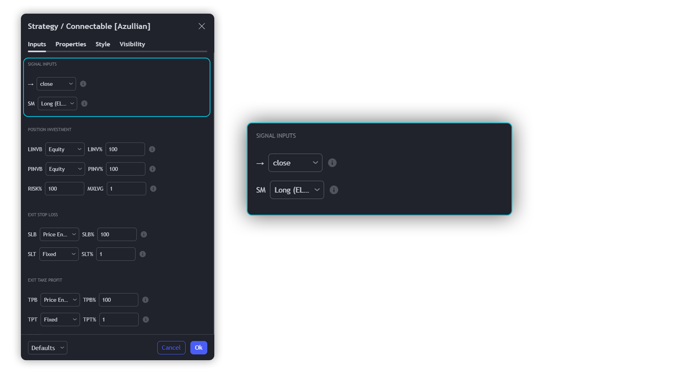
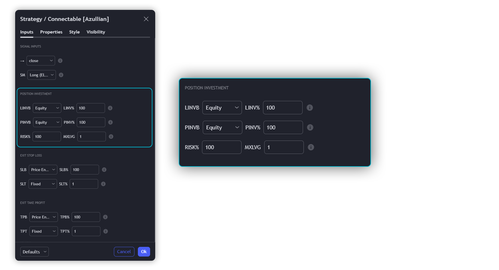
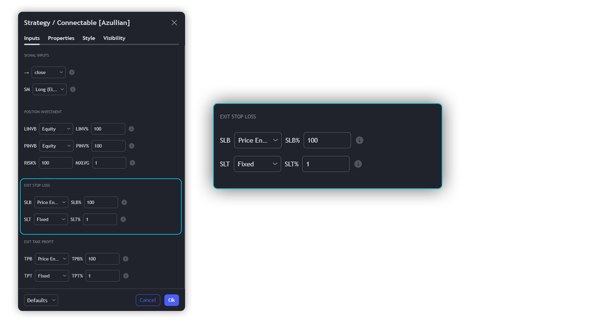
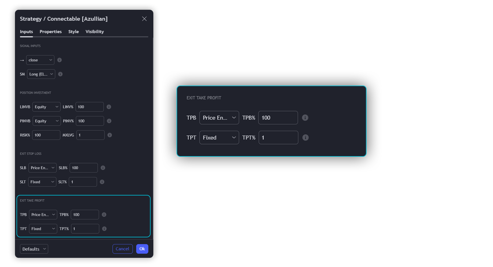
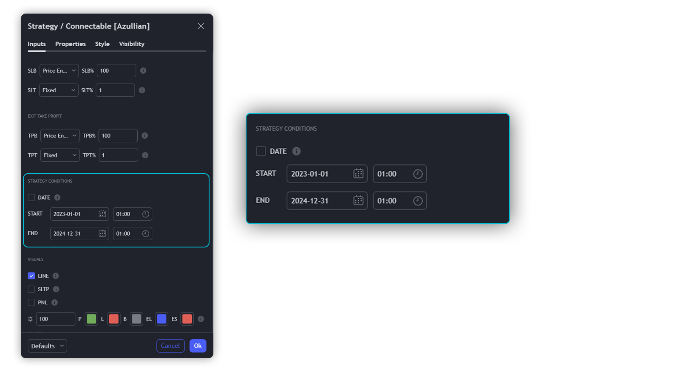
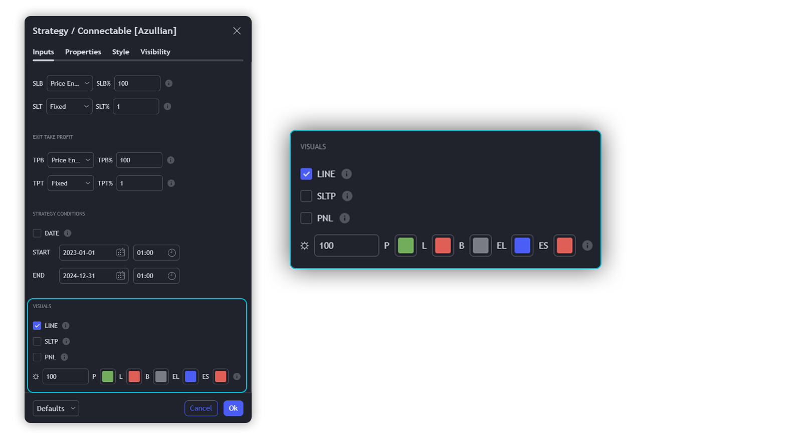
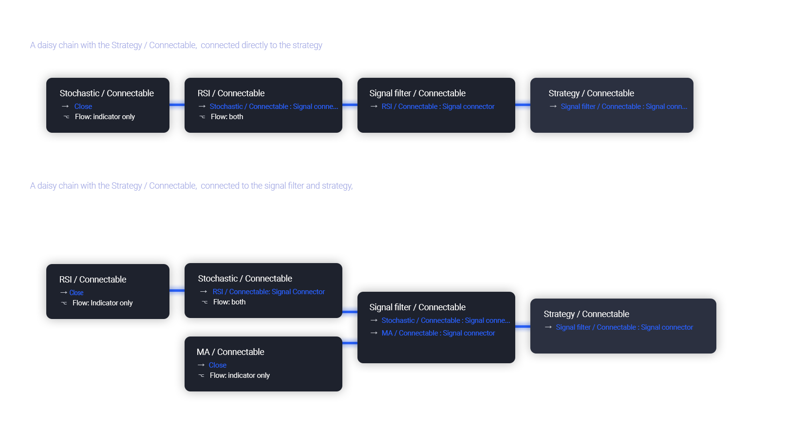

# Connectable Strategy Indicator Guide

The connectable strategy serves as a foundational component in our indicator system on TradingView, designed for intuitive testing, visualization, and construction of trading strategies. In concert with the connectable signal filter, it forms a cohesive unit that allows for efficient signal processing and strategy implementation. This integration enables the strategy to receive and act on weighted signals from various connectable indicators, making it a versatile tool for both novice and experienced traders.

## Strategy Inputs

We've provided an input to connect a signal filter, indicators, or chains (→), which is set to 'Close' by default.

An input has several controls:
- **Input:** Connect indicators or a signal filter here, choose indicators with a compatible Signal connector.
- **SM - Signal Mode:** Choose a trading direction compatible with the settings in your signal filter.

## Position Investment

Determine the percentage of your trading budget you would like to use in each position based on the strategy's profit or loss.

- **LINVB - Loss Investment Base:** Choose which base to use to determine the investment percentage when the strategy is in a loss.
  - Equity: Use the equity as the base for percentage calculation.
  - Initial capital: Use the initial capital as the base for percentage calculation.
- **LINV% - Loss Investment Percentage:** Set a percentage of the chosen investment base as the investment for a new position.
- **PINVB - Profit Investment Base:** Choose which base to use to determine the investment percentage when the strategy is in profit.
  - Equity: Use the equity as the base for percentage calculation.
  - Initial capital: Use the initial capital as the base for percentage calculation.
- **PINV% - Profit Investment Percentage:** Set a percentage of the chosen investment base as the investment for a new position.
- **RISK% - Risk Percentage:** Determine how much of the calculated position investment is at risk when the stop-loss is hit.
- **MXLVG - Maximum Leverage:** Investigate the trading rules for your trading pair and use the maximum allowed amount of leverage.

## Exit Stop Loss

Determine the Stop Loss price based on your selected configuration. As the stop loss is an integral part of the ordered contracts calculation used in conjunction with the Risk and Max leverage, you'll always need to provide a stop loss price.

- **SLB - Stop Loss Base:** Choose a stop loss mode for calculating stop loss prices.
  - Risk: Determines the price using the Risk parameter (RISK%) and maximum leverage (MXLVG).
  - Price Entry + Offset: Calculates the stop loss price based on an offset percentage (SLB%) from the entry price of the position.
- **SLB% - Stop Loss Base Percentage:** Define an offset percentage that will be applied in the price entry + offset stop loss mode.
- **SLT - Stop Loss Trailing:**
  - Fixed: The initial stop loss will be kept, and no trailing stop loss will be applied.
  - Trail Price: Computes the trailing stop loss price based on an offset percentage (SLT%) from the closing price of the current candle.
  - Trail Incr: Adapts the trailing stop loss price based on the offset percentage (SLT%).

## Exit Take Profit

Determine the Take Profit price based on your selected configuration.

- **TPB - Take Profit Base:** Choose a take profit mode for calculating take profit prices.
  - Reward: Determines the take profit price using the Risk parameter (RISK%), the calculated Stop Loss price, and the set reward percentage (TPB%).
  - Price Entry + Offset: Calculates the take profit price based on an offset percentage (TPB%) from the entry price of the position.
- **TPB% - Take Profit Base Percentage:** Define an offset percentage that will be applied in the price entry + offset take profit mode.
- **TPT - Take Profit Trailing:**
  - Fixed: The initial take profit will be kept, and no trailing take profit will be applied.
  - Trail Price: Computes the trailing take profit price based on an offset percentage (TPT%) from the closing price of the current candle.
  - Trail Incr: Adapts the trailing take profit price based on the offset percentage (TPT%).

## Strategy Conditions

Specify when the strategy is permitted to execute trades.

- **DATE:** Enable the Date Range filter to restrict entries to a specific date range.
  - START: Set a start date and hour to commence trading.
  - END: Set an end date and hour to conclude trading within the defined range.

## Visuals

- **LINE:** Activate a colored dashed diagonal line to visually connect the entry and exit points of positions.
- **SLTP:** Enable visualization of stop loss, take profit, and break-even levels.
- **PNL:** Enable Break-Even and Close Lines along with a colored area in between to visualize profit and loss.
- **☼: Brightness % :** Adjust the opacity of the plotted trading visuals.
- **P - Profit Color :** Choose the color for profit-related elements.
- **L - Loss Color:** Choose the color for loss-related elements.
- **B - Breakeven Color :** Select the color for break-even points.
- **EL - Long Color:** Specify the color for long positions.
- **ES - Short Color:** Specify the color for short positions.
- **TRADE LABELING:** For better analysis, we've labeled all entries and exits conforming to the type of order your strategy has executed.

## Usage of Connectable Indicators

### Connectable Chaining Mechanism

Connectable indicators can be connected directly to the signal monitor, signal filter, or strategy through the provided inputs (→). They can also be daisy-chained using the indicator input (→). The first in a daisy chain should have a flow (⌥) set to 'Indicator only', while subsequent indicators use 'Both' to pass the previous weight. The final indicator connects to the signal monitor, signal filter, or strategy.

### Set up the strategy with a signal filter and an RSI indicator

Let's connect the Strategy to a connectable signal filter and a connectable RSI indicator:

1. **Load all relevant indicators**:
   - Load RSI / Connectable
   - Load Signal filter / Connectable
   - Load Strategy / Connectable

2. **Signal Filter: Connect the RSI to the Signal Filter**:
   - Open the signal filter settings.
   - Choose one of the three input dropdowns (1→, 2→, 3→) and select 'RSI / Connectable'.

3. **Strategy: Connect the Signal Filter to the Strategy**:
   - Open the strategy settings.
   - Choose one of the three input dropdowns (1→, 2→, 3→) and select 'Signal Filter / Connectable'.

4. **Configure the RSI settings**:
   - Open the RSI settings and set your preferred RSI period, overbought, and oversold levels.

5. **Configure the Signal Filter settings**:
   - Define your filter conditions in the signal filter settings. The filter can include various criteria like RSI values and price conditions.

6. **Strategy Configuration**:
   - Configure your strategy parameters according to your trading preferences, considering the signal filter and RSI input.

7. **Activate the Strategy**:
   - Enable the strategy using the toggle switch.

Now, your strategy is set up to consider RSI signals and filter them according to your defined conditions. Adjust the parameters as needed for your trading strategy.

## Conclusion

The [i]connectable strategy[/i] is a vital component of the Azullian trading system. By effectively connecting indicators, signal filters, and strategies, traders can implement well-informed and automated trading strategies. It's a versatile tool that caters to both beginners and professionals in the trading world. Experiment with different configurations and optimize your strategy for successful trading outcomes.

For any further assistance or inquiries, feel free to contact our support team. Happy trading!
